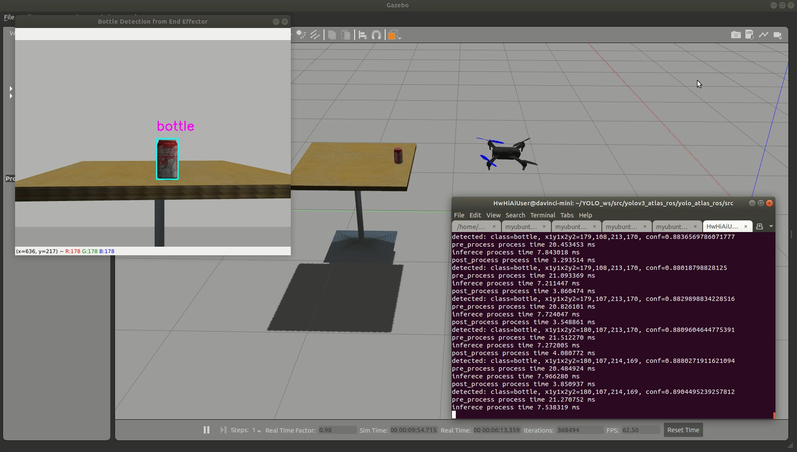

# Gazebo Atlas200DK半实物仿真平台

## Overview
在Gazebo仿真器上向Atlas200DK实时传输无人机摄像头信息，通过Atlas200DK NPU运行YOLOX算法检测抓取物体位置


## Hardware Setup
默认PC与Atlas操作系统为Ubuntu18.04

### PC & Atlas Dependencies
PC和Atlas上需要安装ROS依赖：
```
sudo apt install ninja-build exiftool ninja-build protobuf-compiler libeigen3-dev genromfs xmlstarlet libgstreamer1.0-dev libgstreamer-plugins-base1.0-dev python-pip python3-pip gawk
pip install --upgrade setuptools
python -m pip install --upgrade pip
pip2 install pandas jinja2 pyserial cerberus pyulog==0.7.0 numpy toml pyquaternion empy pyyaml 
pip3 install packaging numpy empy toml pyyaml jinja2 pyargparse
```

### PC & Atlas ROS Installation
PC和Atlas上的ROS安装：
```
sudo sh -c '. /etc/lsb-release && echo "deb http://mirrors.tuna.tsinghua.edu.cn/ros/ubuntu/ `lsb_release -cs` main" > /etc/apt/sources.list.d/ros-latest.list'
sudo apt-key adv --keyserver 'hkp://keyserver.ubuntu.com:80' --recv-key C1CF6E31E6BADE8868B172B4F42ED6FBAB17C654
sudo apt update
sudo apt install ros-melodic-desktop-full
sudo rosdep init
rosdep update
```

配置~/.bashrc
```
echo "source /opt/ros/melodic/setup.bash" >> ~/.bashrc
source ~/.bashrc
```

### PC Gazebo Installation
PC上的Gazebo安装：
```
sudo apt-get remove gazebo* 
sudo apt-get remove libgazebo*
sudo apt-get remove ros-melodic-gazebo* #kinetic noetic对应修改
sudo apt-get install ros-melodic-moveit-msgs ros-melodic-object-recognition-msgs ros-melodic-octomap-msgs ros-melodic-camera-info-manager  ros-melodic-control-toolbox ros-melodic-polled-camera ros-melodic-controller-manager ros-melodic-transmission-interface ros-melodic-joint-limits-interface
sudo apt install gazebo9 libgazebo9-dev
```

### PC mavros Installation
PC上的mavros安装：
```
sudo apt install ros-kinetic-mavros ros-kinetic-mavros-extras 		# for ros-kinetic
sudo apt install ros-melodic-mavros ros-melodic-mavros-extras 		# for ros-melodic
wget https://gitee.com/robin_shaun/XTDrone/raw/master/sitl_config/mavros/install_geographiclib_datasets.sh
sudo chmod a+x ./install_geographiclib_datasets.sh
sudo ./install_geographiclib_datasets.sh #这步需要装一段时间
```

### PC PX4 Installation
PC上的px4安装:
```
git clone https://github.com/PX4/PX4-Autopilot.git
mv PX4-Autopilot PX4_Firmware
cd PX4_Firmware
git checkout -b xtdrone/dev v1.11.0-beta1
git submodule update --init --recursive
make px4_sitl_default gazebo
```

然后修改~/.bashrc
```
source ~/catkin_ws/devel/setup.bash
source ~/PX4_Firmware/Tools/setup_gazebo.bash ~/PX4_Firmware/ ~/PX4_Firmware/build/px4_sitl_default
export ROS_PACKAGE_PATH=$ROS_PACKAGE_PATH:~/PX4_Firmware
export ROS_PACKAGE_PATH=$ROS_PACKAGE_PATH:~/PX4_Firmware/Tools/sitl_gazebo
```

再测试一下px4
```
source ~/.bashrc
cd ~/PX4_Firmware
roslaunch px4 mavros_posix_sitl.launch
rostopic echo /mavros/state
```
如果上面的rostopic命令显示connected: True，说明MAVROS与gazebo通信成功

## Source Build
在PC上克隆本代码：
```
git clone https://github.com/HITSZ-NRSL/atlas-perception-in-gazebo.git
```

### Build in PC
编译PC端代码：
```
cd src
catkin build
```

### Build in Atlas200DK
启动Atlas并与主机通过ssh连接后，将scripts/YOLO_ws文件夹拷到Atlas上，然后进行编译
```
cd YOLO_ws/
catkin build
```

## ROS Communication Setup
由于Atlas200DK需要通过ROS通信接收仿真环境中的无人机摄像头图像，因此需要在PC和Atlas上设置多机ROS通信

### in PC
PC端，在~/.bashrc末尾写入
```
export ROS_IP=192.168.1.166
export ROS_MASTER_URI=http://192.168.1.166:11311
```

### in Atlas200DK
Atlas端，在~/.bashrc末尾写入
```
export ROS_IP=192.168.1.2
export ROS_MASTER_URI=http://192.168.1.166:11311
```

## Demo
### PC Demo
PC半实物仿真环境开启：
```
cp scripts/launch/* ~/PX4_Firmware/launch/
```

打开一个终端,
```
source devel/setup.bash
roslaunch px4 iris_realsense_empty.launch
```

打开一个终端，
```
source devel/setup.bash
python scripts/communication/multirotor_communication.py iris 0
```

打开一个终端，
```
source devel/setup.bash
python scripts/control/control_uav_flying.py
```

此时可以看到无人机飞到桌子前

### Atlas200DK Demo
Atlas感知算法开启：
```
source devel/setup.bash
cd src/yolov3_atlas_ros/yolo_atlas_ros/src
python3 acl_ros_yolox_raw.py
```
看到打印检测坐标时，表示感知成功
